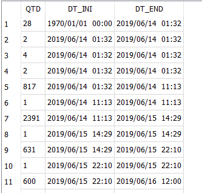

# Forensic Scripts

## Table of Contents

<details>
<summary>WhatsApp</summary>

* [`Analyze removed messages`](#removed-messages)
* [`Find Whatsapp Key`](#find-whatsapp-key)
</details>


<hr />

## <a name="removed-messages"></a>Analyze removed messages
#### Expected results

It is exptected to have an idea of when the user might have deleted messages

 

#### Code

First image

```sql
		select 
			deleted.next_id-deleted._id as QTD, 
			deleted.dt_str as DT_INI,
			(select strftime('%Y/%m/%d  %H:%M', datetime(C.timestamp/1000, 'unixepoch')) from messages C where C._id=deleted.next_id) as DT_END
			from (
				select A._id, 
				(select min(_id) 
					from messages B 
					where B._id>A._id) as next_id,
				strftime('%Y/%m/%d  %H:%M', datetime(A.timestamp/1000, 'unixepoch')) as dt_str
			from messages A) deleted
		where deleted.next_id-deleted._id
		order by deleted.dt_str
```

Second image

```sql
select sum(QTD) as SUM_QTD, substr(DT_END,0, 8) as YEAR_MONTH
	from (
		select 
			deleted.next_id-deleted._id as QTD, 
			deleted.dt_str as DT_INI,
			(select strftime('%Y/%m/%d  %H:%M', datetime(C.timestamp/1000, 'unixepoch')) from messages C where C._id=deleted.next_id) as DT_END
			from (
				select A._id, 
				(select min(_id) 
					from messages B 
					where B._id>A._id) as next_id,
				strftime('%Y/%m/%d  %H:%M', datetime(A.timestamp/1000, 'unixepoch')) as dt_str
			from messages A) deleted
		where deleted.next_id-deleted._id
	) as final_group
group by substr(DT_END,0, 8)
order by substr(DT_END,0, 8) desc
```

#### <a name="find-whatsapp-key"></a>Find Whatsapp Key

About to add some more...


